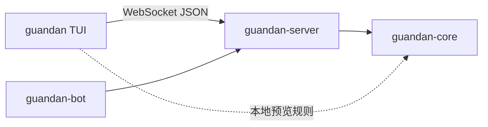

<div align="center">

# 🥚 掼蛋 · Guandan

**公平、开源、终端里的掼蛋**

真随机发牌 · 无控牌 · 本地人机 / 联网对战 · Rust 实现

[](https://github.com/SihanTeng/guan-dan/actions/workflows/ci.yml)
[](https://github.com/SihanTeng/guan-dan/actions/workflows/release.yml)
[](LICENSE)
[](https://www.rust-lang.org/)

[English](#english) · [安装](#-安装) · [游戏规则](#-游戏规则) · [开发](#-开发) · [Code of Conduct](CODE_OF_CONDUCT.md)

</div>

---

## 为什么做这个项目

掼蛋是江苏淮安起源、风靡长三角的四人组队扑克。我们希望它和「斗地主」一样，可以在终端里干净地玩：

- **真随机发牌** — 无控牌、无「新手保护」套路  
- **规则透明** — 引擎与协议开源，欢迎审计  
- **人机 / 联网** — 一键练习，或开房间四人对战  
- **公平第一** — 技巧与运气，而不是算法与钱包  

架构与终端体验受 [fight-the-landlord](https://github.com/palemoky/fight-the-landlord) 启发；规则脉络参考 [Wikipedia · Guandan](https://en.wikipedia.org/wiki/Guandan)。

---

## ✨ 特性

| | |
|---|---|
| 🃏 **完整核心规则** | 级牌、逢人配、炸弹阶梯、进贡 / 抗贡、升级打过 A |
| 👥 **4 人两队** | 对家协作（座位 0+2 / 1+3） |
| 🤖 **人机练习** | 1 真人 + 3 启发式 bot |
| 🌐 **多人房间** | 创建 / 加入 / 快速匹配 |
| ⌨️ **双输入** | 方向键选牌 + 点数快捷键 |
| 🌏 **双语 UI** | 中文为主，关键处英文 |
| 🧩 **模块化** | 纯引擎 crate，服务端权威校验 |

---

## 🚀 安装

### 一键安装客户端

**macOS / Linux**

```bash
curl -fsSL https://raw.githubusercontent.com/SihanTeng/guan-dan/main/install.sh | bash
```

**Windows (PowerShell)**

```powershell
irm https://raw.githubusercontent.com/SihanTeng/guan-dan/main/install.ps1 | iex
```

> 需要已有 GitHub Release。尚无 release 时请用下方「从源码运行」。

安装后：

```bash
guandan                          # 连接默认 ws://127.0.0.1:9100
guandan --server ws://host:9100  # 指定服务器
```

### 从源码运行

需要 [Rust](https://rustup.rs/) 1.75+。

```bash
git clone https://github.com/SihanTeng/guan-dan.git
cd guan-dan

# 终端 1 — 服务器
cargo run -p guandan-server -- --bind 0.0.0.0:9100

# 终端 2 — 客户端
cargo run -p guandan-client -- --server ws://127.0.0.1:9100
```

或使用 Makefile：

```bash
make run-server
make run-client
```

大厅选择 **人机练习** 即可开局。

---

## 🎮 按键

| 键 | 功能 |
|----|------|
| `↑` `↓` / `Enter` | 大厅菜单 |
| `←` `→` | 移动手牌光标 |
| `Space` | 选中 / 取消当前牌 |
| `3`–`9` `T`/`0` `J Q K A 2` `B`/`R` | 按点数多选 |
| `Enter` | 出牌 / 回贡 |
| `P` | 不出 |
| `C` | 记牌器开关（他人剩余张数，本局内可随时开/关） |
| `H` | 帮助 |
| `Esc` | 返回 |
| `Ctrl+C` | 退出 |

---

## 📖 游戏规则

| 项目 | 说明 |
|------|------|
| 人数 | 4 人两队，对家协作 |
| 牌组 | 2 副 + 4 王 = **108** 张，每人 **27** |
| 级牌 | 当前所打点数，大于 A、小于王 |
| 逢人配 | 两张**红心**级牌，组牌时可当任意非王 |
| 普通牌型 | 单、对、三张、三带二、顺子(5)、三连对、钢板 |
| 炸弹 | 4/5 张 → 同花顺 → 6+ 张 → **天王炸**(四王) |
| 升级 | 头游+二游 **+3**；+三游 **+2**；+下游 **+1** |
| 胜利 | 已在 A 级再胜一局（含上局下游限制，见引擎） |

更细的实现说明见 `crates/guandan-core`。

---

## 🏗 架构

```
guan-dan/
├── crates/
│   ├── guandan-core/       # 纯引擎：牌 · 规则 · 对局状态机
│   ├── guandan-protocol/   # JSON WebSocket 消息
│   ├── guandan-bot/        # 启发式机器人（只出合法牌）
│   ├── guandan-server/     # tokio + tungstenite 服务端
│   └── guandan-client/     # ratatui 终端 UI
├── install.sh / install.ps1
├── .githooks/pre-commit    # fmt + clippy + check
└── .github/workflows/      # CI · Release
```

**原则：** `guandan-core` 零网络 / UI 依赖；服务端权威校验出牌。



---

## 🛠 开发

```bash
# 安装 git hooks（fmt / clippy / check）
make hooks

# 格式化 · 静态检查 · 测试
make fmt
make lint
make test

# 发布构建
make build
```

### Pre-commit

Hook 位于 `.githooks/pre-commit`，对暂存的 Rust 变更运行：

1. `cargo fmt --all -- --check`
2. `cargo clippy --workspace --all-targets -- -D warnings`
3. `cargo check --workspace --all-targets`

```bash
make hooks   # git config core.hooksPath .githooks
```

### CI / Release

| Workflow | 触发 | 内容 |
|----------|------|------|
| **CI** | push / PR → `main` | fmt · clippy · test · release build |
| **Release** | tag `v*.*.*` | 多平台 client/server 二进制 + checksum + GitHub Release |

打标签发版：

```bash
git tag v0.1.0
git push origin v0.1.0
```

---

## 🤝 贡献

欢迎 Issue 与 PR。参与前请阅读 [Code of Conduct](CODE_OF_CONDUCT.md)。

1. Fork 本仓库  
2. `git checkout -b feature/awesome`  
3. `make hooks && make test`  
4. 开 Pull Request  

---

## 🗺 路线图

- [ ] 更强的 bot 策略 / 可选 RL  
- [ ] 断线重连完整恢复  
- [ ] 可选 Protobuf 协议  
- [ ] Docker 一键部署  
- [x] 记牌器（C 键开关，双副剩余）  
- [ ] 观战  


---

## 📄 License

[MIT](LICENSE) © 2026 SihanTeng and contributors

---

## English

**Guandan** is a terminal multiplayer card game written in Rust: fair shuffle, open rules, practice bots, and WebSocket rooms. Inspired by [fight-the-landlord](https://github.com/palemoky/fight-the-landlord); rules follow the [Wikipedia Guandan](https://en.wikipedia.org/wiki/Guandan) outline.

```bash
# Install (after a GitHub Release exists)
curl -fsSL https://raw.githubusercontent.com/SihanTeng/guan-dan/main/install.sh | bash

# Or from source
cargo run -p guandan-server -- --bind 0.0.0.0:9100
cargo run -p guandan-client -- --server ws://127.0.0.1:9100
```

See tables above for keys, rules, and crate layout. Be excellent to each other — [Code of Conduct](CODE_OF_CONDUCT.md).

<div align="center">

**Fair cards. Open source. Terminal first.**

</div>
